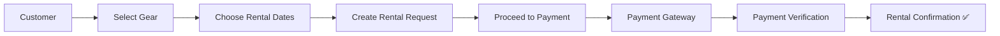
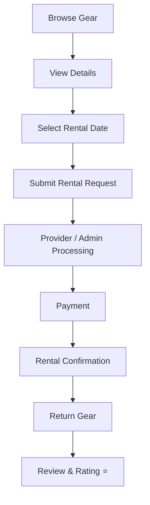

<div align="center">

```
   ██████╗ ███████╗ █████╗ ██████╗ ██╗   ██╗██████╗ 
  ██╔════╝ ██╔════╝██╔══██╗██╔══██╗██║   ██║██╔══██╗
  ██║  ███╗█████╗  ███████║██████╔╝██║   ██║██████╔╝
  ██║   ██║██╔══╝  ██╔══██║██╔══██╗██║   ██║██╔═══╝ 
  ╚██████╔╝███████╗██║  ██║██║  ██║╚██████╔╝██║     
   ╚═════╝ ╚══════╝╚═╝  ╚═╝╚═╝  ╚═╝ ╚═════╝ ╚═╝     
```

### 🎒 Gear Up. Head Out. Come Back.

*A role-based rental ecosystem where adventurers find gear, providers run their business, and admins keep it all running.*

[](https://gear-up-frontend-one.vercel.app)
[](https://gearup-backend-szbl.onrender.com)
[](https://github.com/mca-programmer/GearUp)


</div>

---

## 📖 Table of Contents

- [About](#-about)
- [Key Features](#-key-features)
- [Authentication & Roles](#-authentication--roles)
- [Payment Flow](#-payment-flow)
- [Tech Stack](#️-tech-stack)
- [Project Structure](#-project-structure)
- [Getting Started](#-getting-started)
- [Available Scripts](#-available-scripts)
- [API Integration](#-api-integration)
- [Rental Workflow](#-rental-workflow)
- [Screenshots](#-screenshots)
- [Roadmap](#-roadmap)
- [Developer](#-developer)
- [License](#-license)

---

## 📌 About

Not everyone needs to *own* a tent, a kayak, or a pair of skis — they just need it **for the weekend**. That's the problem GearUp solves.

It's a **decoupled, three-sided marketplace**: a Next.js + TypeScript frontend talking to a secure Node.js/Express REST API, wired together with JWT auth, online payments, and a review system — so gear finds its way from someone's storage room to someone's backpack, safely and on schedule.

<table>
<tr>
<td width="33%" align="center">

**👤 Customer**
finds gear, books dates, pays, reviews

</td>
<td width="33%" align="center">

**🏪 Provider**
lists gear, tracks stock, fulfills orders

</td>
<td width="33%" align="center">

**👨‍💼 Admin**
oversees users, gear & the whole platform

</td>
</tr>
</table>

> 🧭 **One codebase, three experiences** — every dashboard is shaped by the role that logs in.

---

## ✨ Key Features

<details open>
<summary><b>👤 Customer</b></summary>

- Browse available sports & outdoor gear
- Search and filter equipment
- View detailed gear information
- Select rental dates
- Place rental requests/orders
- Make secure online payments
- Track rental status in real time
- Manage personal profile
- Submit reviews and ratings

</details>

<details>
<summary><b>🏪 Provider</b></summary>

- Add, update & delete gear listings
- Manage inventory levels
- View incoming rental requests
- Manage and fulfill rental orders
- Track gear availability
- Manage provider profile

</details>

<details>
<summary><b>👨‍💼 Admin</b></summary>

- Centralized admin dashboard
- Manage users, providers & customers
- Manage gear/products and categories
- Monitor platform-wide rental activity
- Full control over platform data

</details>

---

## 🔐 Authentication & Roles

GearUp implements **JWT-based authentication** with strict **role-based access control (RBAC)**.

| Role | Icon | Access Level |
|------|:----:|---------------|
| Customer | 👤 | Browse, rent, pay & review gear |
| Provider | 🏪 | Manage gear & rental orders |
| Admin | 👨‍💼 | Full platform management |

**Core auth capabilities:** registration · login · protected & role-based routes · persistent sessions · secure API communication.

---

## 💳 Payment Flow



---

## 🛠️ Tech Stack

<table>
<tr>
<td valign="top" width="33%">

**Frontend**
- ⚛️ React
- ▲ Next.js
- 🟦 TypeScript
- 🎨 Tailwind CSS
- 🧩 shadcn/ui
- 📡 REST API

</td>
<td valign="top" width="33%">

**Backend**
- 🟢 Node.js
- 🚂 Express.js
- 🔐 JWT Authentication
- 🛡️ Role-Based Authorization
- 📡 REST API

</td>
<td valign="top" width="33%">

**Database & Services**
- 🗄️ Database
- ☁️ Cloudinary
- 💳 Payment Gateway

</td>
</tr>
</table>

**Dev tooling:** Git · GitHub · VS Code · Postman · Vercel · Render

---

## 📁 Project Structure

```text
GearUp/
│
├── public/
│   ├── images/
│   └── assets/
│
├── src/
│   ├── app/
│   ├── components/
│   ├── hooks/
│   ├── lib/
│   ├── services/
│   ├── types/
│   └── utils/
│
├── API_INTEGRATION.md
├── components.json
├── next.config.ts
├── package.json
├── tsconfig.json
└── README.md
```

---

## 🚀 Getting Started

```bash
# 1. Clone the repository
git clone https://github.com/mca-programmer/GearUp.git

# 2. Move into the project directory
cd GearUp

# 3. Install dependencies
npm install
```

**4. Configure environment variables** — create a `.env.local` file:

```env
NEXT_PUBLIC_API_URL=https://gearup-backend-szbl.onrender.com
```

**5. Run the development server**

```bash
npm run dev
```

Then open **[http://localhost:3000](http://localhost:3000)** in your browser. 🎉

---

## 📜 Available Scripts

| Command | Description |
|---------|-------------|
| `npm run dev` | Start development server |
| `npm run build` | Build production application |
| `npm run start` | Start production application |
| `npm run lint` | Run ESLint |

---

## 🔌 API Integration

GearUp's frontend communicates with the backend exclusively through REST APIs.

> **Backend API base URL:** `https://gearup-backend-szbl.onrender.com`

For full endpoint documentation, see **[API_INTEGRATION.md](./API_INTEGRATION.md)**.

---

## 🔄 Rental Workflow



---

## 📱 Responsive Design

Built mobile-first and tested for a consistent experience across:

💻 Desktop &nbsp;•&nbsp; 💻 Laptop &nbsp;•&nbsp; 📱 Tablet &nbsp;•&nbsp; 📱 Mobile

---

## 🔮 Roadmap

- [ ] Advanced gear recommendation system
- [ ] Real-time notifications
- [ ] Advanced analytics dashboard
- [ ] Location-based gear search
- [ ] Wishlist functionality
- [ ] Chat between customers and providers
- [ ] Improved payment and refund workflow
- [ ] Progressive Web App (PWA) support

---

## 👨‍💻 Developer

<div align="center">

### Mosharraf Hosen
**Frontend / MERN Stack Developer**

[](https://github.com/mca-programmer)
[](https://musarraf-portfolio.vercel.app/)

</div>

---

## 📄 License

This project is developed for **educational, portfolio, and demonstration purposes**.

---

<div align="center">

### 🏕️ Adventure runs on gear. Gear runs on GearUp.

⭐ **Found this useful? A star goes a long way.**

*Crafted with ❤️, Next.js & a genuine love for the outdoors.*

</div>